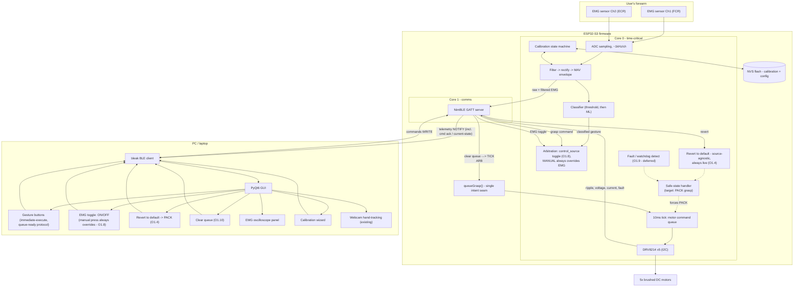

# EMG Gesture Control & Smart Interface — Development Plan

**Project:** EPSRC Prosthetic Hand Development (ENG:04)
**Scope:** EMG acquisition → calibration → gesture classification, BLE link, PyQt6 control/telemetry GUI
**Author context:** Newcastle University, MEng project, supervised by Dr. Matthew Dyson
**Date:** 2026-07-21
**Revision:** 4 — resolved the open questions from Rev 3 (§12): control mode means source-authority (Manual XOR EMG), collapsed into one toggle button with manual always overriding; safe state is the existing `PACK` grasp; STOP and the kill switch merge into one "revert to default" control; a new "clear queue" control added; fault-detection watchdog (O1.9) deferred; EXP-09 confirmed as a standalone sandbox, separate from `robolimb_esp32`, merged in only after validation. §12 entries marked RESOLVED below; one new item (U8) surfaced by this round.
**Status:** Pre-development — planning document

---

## 0. What actually exists today

Before designing anything new, it's worth being precise about the current state, because the three pieces of the project that exist right now don't yet talk to each other:

| Component | File(s) | What it actually does | What it doesn't do |
|---|---|---|---|
| **Real motor firmware** | `src/main.cpp`, `lib/drv8214_multiplatform/` | Drives 5× real DRV8214-controlled motors over I2C, current-regulated, with a 10ms-tick command queue (`FIFObuf<motorCommand>`) and 8 named grasps via `queueGrasp()`. Takes commands over **Serial only** (typed integers). | No BLE, no WiFi, no telemetry out, no EMG. |
| **BLE/telemetry firmware** | (not in this repo — referenced as `exp08_telemetry_gesture` in GUI comments/docs) | NimBLE GATT server, advertises `ProHand-Test`, pushes a 77-byte mock motor-telemetry frame at 5Hz, accepts grasp/LED commands. | **Simulated motors only** — comments in the GUI confirm "no real motor hardware attached." Doesn't drive the real DRV8214s. |
| **PC GUI** | `telemetry_gui.py` | PyQt6 + `bleak` + `qasync` app: motor telemetry table, fault panel, 8 grasp buttons, webcam-based hand-tracking demo, digital-twin hand render. Talks to the BLE firmware above. | No EMG anywhere in it. |

**The single biggest pre-requisite this plan surfaces that wasn't in the original ask: the real motor firmware and the BLE firmware need to be merged before EMG control means anything end-to-end.** Right now, sending a grasp command over BLE moves a *simulated* hand, not the real one. That merge is Phase 0 below, and it's on the critical path — EMG classification has nothing to actuate until it exists. **As of this revision, that merge is designated EXP-09** — it builds directly on exp08's BLE/telemetry skeleton, continuing the project's numbered bring-up sequence rather than sitting outside it (see §2.5). This bumps the EMG raw-ADC bring-up experiment, previously proposed as EXP-09, to **EXP-10** (§5.1, O2.1).

This document also draws on the project's existing literature base (Nayyar's closed-loop-feedback thesis, Wu/Dyson/Nazarpour's Arduino myoelectric system paper, Dyson's 2018 abstract-decoder paper, Fougner et al.'s control-terminology review) and the existing `context.md` / PRD, which originally scoped the GUI as a browser-based Web Bluetooth app. You're now building it as Python/PyQt instead — noted below as a deliberate, reasonable substitution (Web Bluetooth's inconsistent browser support, especially on Windows/Safari, is a common reason to move to a native client; `bleak` also gives you far better signal-processing/plotting tooling via numpy than a browser can).

---

## 1. Critical review — gaps, risks, and open questions

This is the "grill it" pass you asked for, scoped to firmware/software (mechanical, electrical/EMI, power budgeting, and ethics/data-handling are deliberately left out per your steer — they matter, but they're tracked elsewhere). Every finding below says where it's now addressed in the reordered plan, so this section doubles as a changelog against Rev 1.

### 1.1 Control arbitration and manual override are asserted, not designed

§2.1 (below) already names the right principle — one seam, `queueGrasp()` — and actually names **three** intended callers of it: GUI buttons, webcam hand-tracking, and EMG. What it never specifies is what happens when more than one of those is live at once. That's a gap worth closing *before* a second caller exists, not after, because retrofitting arbitration onto a command path already serving two live callers is a much bigger change than designing it in now with one real caller (GUI) and a stub for the next one (EMG).

| # | Finding | Why it matters | Where it's fixed |
|---|---|---|---|
| C1.1 | No arbitration policy for competing intent sources | Once EMG exists, what wins if the GUI and the classifier try to command different grasps within the same second? Undefined today. | Phase 1 (O1.2), exercised again in Phase 4 |
| C1.2 | In-flight command preemption is unspecified | If a power-grip close is mid-travel and a new command arrives, does it queue behind, abort-and-reverse, or get rejected? The `FIFObuf` shape implies "queues behind," but that's inferred, not decided or tested. | Phase 1 (O1.2) |
| C1.3 | "Safe state" on BLE disconnect is asserted (§2.2) but never defined | Hold last position? Stop-in-place? Release to open? Matters a lot if the hand is gripping something when the link drops. | Phase 1 (O1.3) |
| C1.4 | No source-agnostic STOP, distinct from the (later) EMG kill switch | O5.5's kill switch only gates EMG. There's no "halt motors right now regardless of who asked for the last command" control described anywhere, and it's needed as soon as *any* BLE-driven control exists — a stuck GUI button shouldn't need EMG to be dangerous. | Phase 1 (O1.4) |
| C1.5 | It's not even confirmed how many live callers there will be | Section 0 lists "webcam-based hand-tracking demo" as an existing GUI feature and `gesture_to_serial.py` as an existing tool, but it's ambiguous from the current docs whether that CV path drives real BLE motor commands today or is a separate Serial-only / visualization-only path. Worth nailing down during Phase 0, since it changes how many sources Phase 1's arbitration logic actually has to handle. | Phase 0 verification pass, feeds Phase 1 |

### 1.2 Requirements are task lists, not measurable specs

Almost every objective in this document (both revisions) is phrased as a task ("implement X," "port Y") rather than a testable requirement. Two gaps stand out because they're both central and checkable:

| # | Finding | Recommendation |
|---|---|---|
| C2.1 | No end-to-end control-loop latency budget anywhere. §8/O5.1 states a 50ms figure, but that's for GUI scope *rendering*, not the EMG-sample→motor-movement pipeline the whole closed-loop feature depends on. | Real-time myoelectric control literature consistently puts the usable ceiling around 200–300ms end-to-end, with reported performance degradation past ~300ms, and a physiological electromechanical delay of roughly 30–100ms that's already "spent" before any software gets involved ([MDPI *Sensors* 2025](https://www.mdpi.com/1424-8220/25/1/113); [PMC review, real-time EMG pattern recognition](https://pmc.ncbi.nlm.nih.gov/articles/PMC6832440/)). Recommend adopting an explicit budget — e.g. ≤300ms sample-to-actuation, stretch ≤150ms — and splitting it across stages (ADC window, filter group delay, classification, dispatch, motor slew) in Phase 4, so each stage has a number to test against instead of "responsive." |
| C2.2 | No stated classifier accuracy/exit bar for calling Phase 4a "done." | Recommend setting this once baseline data exists rather than inventing a number now — but *decide it's a real-time-trial metric, not an offline confusion-matrix metric*, per O4.8's own citation of Ortiz-Catalan et al. Add as an explicit Phase 4 Definition-of-Done item. |
| C2.3 | No EMG amplitude-resolution/SNR requirement, despite the entire Phase 4a MVP being "compare a small MAV value against a calibrated threshold" | See C3.1 below — this is where it actually bites. |

### 1.3 EMG signal-chain implementation risk specific to the ESP32-S3

| # | Finding | Why it matters | Where it's fixed |
|---|---|---|---|
| C3.1 | The ESP32-S3's ADC has documented noise sensitivity and input/output nonlinearity | This isn't a hypothetical — Espressif's own developer portal and ESP-IDF docs describe it directly: the ADC benefits from a bypass capacitor at the input pin plus multisampling to control noise, and the raw transfer curve is nonlinear enough (worse near the low/high ends of range) that Espressif ships a software calibration API (two-point or eFuse-based) specifically to correct it ([Espressif developer portal, ADC performance comparison](https://developer.espressif.com/blog/2025/08/adc-performance/); [ESP-IDF ADC peripheral guide](https://docs.espressif.com/projects/esp-idf/en/v4.4/esp32s3/api-reference/peripherals/adc.html)). For most GPIO-adjacent uses this doesn't matter. For a system whose entire MVP is discriminating a small MAV envelope against a calibrated threshold, ADC noise floor and nonlinearity directly set the achievable classification margin. | Phase 2 (O2.1): apply the ESP-IDF ADC calibration API, choose attenuation to keep the working signal range off the documented poor-linearity extremes, add the hardware bypass cap, use oversampling — then *measure* achieved resolution/noise floor on the bench before Phase 3 calibration design assumes any particular precision is available. |
| C3.2 | Signal-chain validation philosophy (§10) doesn't mention validating with the motors actually running | Five brushed DC motors and an I2C bus sharing a board with a low-level analog front-end is a classic setup for switching noise to leak into the rail/ground the ADC references against. Doesn't require new hardware analysis (out of scope per your steer) — just an explicit test-plan line so it's caught on the bench, not mid live-arm session. | Phase 2 exit criteria + §10 testing strategy |

### 1.4 Two channels to eight grasps is asserted, not designed

O3.2 (now O4.2) says the Wu et al. co-contraction pattern (FCR → state 1, FCR+ECR co-contraction → state 2, ECR → reset) will be "adapted to this project's 8-grasp vocabulary." Two channels of simple threshold/co-contraction logic naturally distinguish a handful of discrete states — roughly rest, FCR-only, ECR-only, co-contract — not eight. Amplitude tiers add a *proportional-control* axis, not more discrete grasp identities. Getting from that state space to 8 grasps needs an explicit mechanism, and the plan currently has none. The two standard answers from clinical myoelectric practice: **(a)** mode-cycling — a dedicated trigger (e.g. a sustained co-contraction) steps through an ordered grasp list, with GUI/LED feedback showing current mode — or **(b)** accept that only a subset of the 8 grasps are reachable via Phase 4a threshold control, and the rest wait for Phase 4b pattern recognition. This needs to be a named decision before O4.2 is implemented, because it changes both the firmware state machine and what the GUI has to display (a "current mode" indicator) while EMG control is active. Added as a new objective in Phase 4 (O4.2).

### 1.5 Testing and observability gaps

| # | Finding | Recommendation |
|---|---|---|
| C5.1 | No data-logging strategy | O4.8 rightly insists on real-time closed-loop trials over offline accuracy, but nothing says what gets recorded during those trials. Without raw EMG + extracted features + classifier output + the actual `queueGrasp()` calls timestamped together (ideally with ground truth of intended gesture), a bad trial is undebuggable afterward and there's no dataset accumulating for O4.6's training-data capture. Added as an explicit deliverable in §10. |
| C5.2 | No unit-testing approach named for the new firmware libraries | §2.3 explicitly values "independently testable module[s]," but nothing says *how* they're tested. PlatformIO supports native/host-side unit tests — worth naming so "testable" doesn't stay aspirational prose. Added to §10. |
| C5.3 | No regression mechanism once per-user calibration exists | Recorded EMG sessions (from the "fake EMG firmware mode" already proposed in §10) should be replayable through the DSP/classifier pipeline, so a firmware change can be checked against prior behaviour without a live arm and a live person every time. Added to §10. |
| C5.4 | No CI mentioned for firmware or `telemetry_gui.py` | Doesn't need to be elaborate — worth it being a decision rather than a gap nobody chose. Added to §10. |

### 1.6 Process gaps

| # | Finding | Recommendation |
|---|---|---|
| C6.1 | No Definition-of-Done per phase | Every phase lists objectives (tasks), never what "done" looks like in testable terms. This is the most load-bearing fix in this revision: the entire premise of reordering around risk (always have a demoable fallback) only works if Phase 1's "done" is unambiguous. **Added a Definition-of-Done block to every phase below.** |
| C6.2 | No firmware update path during iterative live-arm testing | USB reflash vs. OTA isn't decided. Minor, but worth one line since Phase 1 onward implies repeated bench/arm iteration cycles. Noted in Phase 1. |
| C6.3 | The BLE command protocol is about to be extended (queue-ready sequencing, per your direction below) — that's exactly the moment O5.6's schema-drift fix should land, not after a second undocumented format grows on top of the first one | Pulled forward into Phase 1 (O1.5/O1.6) rather than left in Phase 5. |

---

## 2. Architectural principles

These are the abstractions worth committing to before writing code, because they determine how painful every later phase is. The target-state architecture all of this is building toward:



### 2.1 One intent-arbitration seam: `queueGrasp()`

The real firmware already has the right shape for this. `queueGrasp(graspName)` is the *only* place that knows how to sequence motors for a named grasp — today it's called from a demo loop and from Serial input. The BLE sandbox firmware calls the equivalent thing from a GATT write. **EMG classification should be a third caller of the exact same function, nothing more.**

Concretely: the EMG classifier's job is to decide "the user wants `POWER`" and call `queueGrasp(POWER)` — it should never touch motor drivers, timing, or the command queue directly. This keeps grasp *execution* (sequencing, timing, safety) as a single source of truth regardless of whether the trigger was a GUI button, webcam hand-tracking, or an EMG contraction. Don't let three intent sources evolve three different paths to the motors — and per §1.1's finding, don't let those three sources reach the point of *coexisting* before deciding how they arbitrate. Phase 1 below builds the arbitration layer (`ARB` in the diagram) while there's still only one real caller to test it against.

### 2.2 Firmware owns safety — always

The existing PRD non-functional requirement ("if the GUI loses connection, the ESP32 must independently fall back to a safe state") is the right instinct and needs to extend to EMG: a noisy or low-confidence classification must never actuate a grasp change. That gating (minimum confidence, minimum hold-time, electrode-quality check) has to live in firmware, not in the PC GUI — the GUI can be closed, crash, or lag; the hand can't inherit that risk. Treat the PC as a *thin client* for EMG the same way it already is for grasp buttons: `queueGrasp()`-callers decide intent, firmware decides whether it's safe to act on it. Per §1.1's finding C1.3, "safe state" itself needs a concrete, chosen definition — that's Phase 1, O1.3, deliberately done before there's an EMG-triggered grasp that might be mid-execution when something goes wrong.

### 2.3 A modular DSP pipeline, matching validated prior art

Wu, Dyson & Nazarpour's Arduino myoelectric system (the direct predecessor to this project) validated a 5-stage decomposition: **signal recording → filtering → feature extraction → controller → motor driver**, built and tested as independent modules. There's no reason to deviate from a decomposition that's already been peer-reviewed and demoed on comparable hardware. Section 9 below maps this directly onto files/modules.

### 2.4 Config-as-data, not scattered magic numbers

While reading `main.cpp` for this plan, several hardware constants were found stated two different ways in the same file or across files (details in §3.2). That's not a criticism of the code — it's exactly what happens when tunable numbers live as inline literals instead of one canonical source. Recommendation: a single config module (even a plain header with named constants, or a small JSON both firmware and Python import/generate from) for everything currently duplicated across `main.cpp` comments, `context.md` prose, and `telemetry_gui.py` comments — ripple counts, `KMC`/`KMC_SCALE`, reduction ratio, EMG thresholds once they exist, and now the queue-ready command-sequencing format introduced in Phase 1. This is a small effort now and a real bug-prevention measure once EMG calibration adds a second category of tunable, per-user constants that must not drift out of sync between firmware and GUI.

### 2.5 Keep the incremental EXP-0X bring-up discipline

The project already has a good habit: `ESP32S3_DevKitC1_Experiments.md` defines numbered, self-contained bring-up experiments (EXP-01 GPIO, EXP-02 BLE) before integration, and the GUI is versioned against "EXP-08." This revision extends that numbering one step further than before: **EXP-09 is now Phase 0** — unifying the real motor firmware into the exp08 BLE/telemetry skeleton — rather than the EMG raw-ADC bring-up. EMG hardware bring-up becomes **EXP-10** (§5.1, O2.1).

**Decided (Rev 4):** EXP-09 is a standalone sandbox, living in its own `esp32s3-experiments/exp-09-.../` folder alongside EXP-01/02, following the exact scaffold in `ESP32S3_DevKitC1_Experiments.md` (own `platformio.ini`, `include/config.h`, `src/main.cpp`). It's where the real-motor-into-BLE merge (O0.1–O0.8) gets built and bench-tested before anything touches the real hand — mirroring exp08's own history as a once-separate sandbox. Only once EXP-09 is validated does it get merged into `robolimb_esp32/src/main.cpp` as its own explicit step (§3, new O0.9). This means Phase 0 now has two stages, not one — see §3's revised objectives.

### 2.6 Dual-core allocation, revisited against what the code actually does

`context.md`'s roadmap proposes Core 0 = motor control + EMG sampling/filtering, Core 1 = BLE. That's still the right split, but one thing worth flagging now: `DRV8214.cpp`'s I2C calls (`getMotorVoltage()`, `getRippleCount()`, etc.) are **blocking, synchronous I2C transactions** — reading full telemetry from all 5 drivers is ~30 blocking reads per cycle. If EMG sampling needs a tight, jitter-free timer on the same core as that I2C polling, the I2C reads need to happen in a way that can't stall the EMG sample timer (a FreeRTOS task with a bounded time budget, not inline in the same tight loop as EMG acquisition). Worth an explicit timing budget once both are running on Core 0 — flagged as a Phase 0/2 risk, not solved here.

### 2.7 Command arbitration is a first-class concern, not a later add-on

New in this revision. The moment more than one thing can call `queueGrasp()`, someone has to decide what happens when two callers disagree within the same control window — and "decide later" is how you end up debugging arbitration bugs and classifier accuracy at the same time, on a live arm. This project has the luxury of *not* doing that: Phase 1 gives you a single real caller (the GUI) to build and test the arbitration/preemption/STOP logic against, before EMG becomes a second caller in Phase 4.

**Decided (Rev 4), replacing this section's earlier hold-off-window recommendation:** control source is a single firmware-held state, `control_source ∈ {MANUAL, EMG}` — the two are mutually exclusive, matching your "either/or, EMG or button, not both" framing. One GUI toggle button switches `control_source` between the two. Manual grasp buttons **always** work regardless of the current value of `control_source` — pressing one both executes the grasp and sets `control_source = MANUAL`, which is what "manual overrides EMG" means concretely: EMG doesn't get a graceful hold-off window, it just stops being consulted until the toggle is flipped back. This is simpler and more testable than the timing-based hold-off window originally proposed here, so it replaces it rather than sitting alongside it. See O1.8.

### 2.8 One EMG toggle, a defined safe state, and two hand-state GUI controls

Resolved this revision — Rev 3 drafted these as three separate, partly-overlapping mechanisms and flagged the overlaps as open questions (§12); here's how they were decided.

**Control mode means source authority, and it's one button, not a mode selector plus a separate EMG-enable flag.** §2.7 already states the mechanism: `control_source ∈ {MANUAL, EMG}`, one GUI toggle, manual always wins when pressed. This also absorbs what Rev 2/3 called the EMG-enable/disable flag (O4.4/O5.5) — there is now exactly one piece of state governing whether EMG can call `queueGrasp()`, not two that could silently disagree with each other. See O1.8; O4.4 and O5.5 are updated to point here instead of describing their own separate flag.

**Safe state is `PACK`.** This resolves the item that's been open since Rev 2 (C1.3/O1.3): BLE-disconnect fallback and the "revert to default" control below both mean *command the existing `PACK` grasp*. This makes §3.2's finding about `PACK`'s undocumented fallthrough into `OPEN` inside `queueGrasp()`'s switch-case load-bearing rather than a nice-to-have cleanup item — if safe state silently executes `PACK` *and then* `OPEN`'s sequence, that's what every disconnect and every future revert-to-default press actually does to the hand. O1.3 now makes confirming this on the bench a hard prerequisite rather than an optional verification-pass item.

**Two hand-state GUI controls, not three.** STOP (O1.4) and the kill switch (previously O1.10) merge into one **"Revert to default"** control: commands `PACK` immediately, bypassing whatever's currently mid-execution in the motor command queue rather than waiting for it to finish. Separately, a **"Clear queue"** control (repurposing the O1.10 slot) flushes pending/in-flight motor-queue entries *without* repositioning the hand — useful when you want to stop queued motion without a full trip back to `PACK`. These are genuinely different actions (one repositions, one only stops queued execution), and the exact firmware-level meaning of "clear queue" against the current single-shot immediate-execute design (§4.1) is this revision's one new open item — see §12, U8.

**Fault-detection fail-safe (O1.9) is deferred, not dropped.** At your direction, the watchdog/invariant-check design stays documented as future work but no longer gates Phase 1's Definition of Done.

---

## 3. Phase 0 — Unify the firmware (prerequisite, not optional)

**Objective: one firmware image that drives the real hand over a real BLE connection, with real telemetry.** Nothing else in this plan is testable end-to-end until this exists. **Designated EXP-09** (§2.5) — the next number after exp08 in the project's bring-up sequence, since this phase takes exp08's BLE/telemetry skeleton as its starting point and builds directly on it. **Two stages, per §2.5's Rev 4 decision:** build and bench-test the merge in the standalone `esp32s3-experiments/exp-09-.../` sandbox first (O0.1–O0.8), then merge the validated result into `robolimb_esp32/src/main.cpp` as an explicit second step (O0.9) — the real hand only ever sees firmware that's already been proven in the sandbox.

### 3.1 Objectives

| # | Objective | Notes |
|---|---|---|
| O0.1 | **EXP-09.** Port `main.cpp`'s real motor control (DRV8214 driver instances, `motorQueue`, `queueGrasp`, `execMotorCommmand`, 10ms tick ISR) into the BLE-enabled firmware codebase | The BLE skeleton currently generates mock telemetry — replace its fake motor state with calls into the real driver. |
| O0.2 | Replace Serial integer input with `CHAR_MOTOR_CMD_UUID` text commands as the primary input path | Keep Serial as a debug fallback (useful for bench testing without BLE). |
| O0.3 | Replace the mock 77-byte telemetry generator with real values from `DRV8214::getRippleCount()`, `getMotorVoltage()`, `getMotorCurrent()`, `getDutyCycle()`, `getFaultStatus()` | GUI needs no changes for this — it already expects this exact frame shape. |
| O0.4 | Resolve the ripple-count width mismatch: the driver's `getRippleCount()` returns a **16-bit** register value, but the telemetry frame allocates a **32-bit** field (`uint32 ripple_count` in `FRAME_FORMAT`) | Decide: accumulate 16-bit hardware rollovers into a software `uint32_t` counter (needed if ripple counts should persist across a full grasp sequence without silently wrapping — a full ~30,000-ripple power-grip closure is close enough to the 65,535 register ceiling to be worth guarding explicitly), or narrow the frame field. Recommend the former. |
| O0.5 | Migrate FreeRTOS task split (Core 0 motor+EMG / Core 1 BLE) | Today's firmware is a single cooperative `loop()` + one ISR — fine for motors alone, not sufficient once BLE and EMG sampling both need airtime. |
| O0.6 | Retire the dead `loop_()` code block (`main.cpp` lines ~409–778, never called) | It's ~370 lines of superseded, `delay()`-heavy motor logic sitting in the same file as the live code. Archive it elsewhere (git history is enough) rather than leaving it as a trap for the next person editing this file. |
| O0.7 | Confirm Arduino-ESP32 core version compatibility between `main.cpp`'s timer API (`timerBegin`/`timerAttachInterrupt`, older-style signature) and whatever core version the NimBLE sandbox firmware was built against | Classic integration risk when merging two codebases developed at different times against a moving toolchain. |
| O0.8 | Confirm whether `gesture_to_serial.py` / the GUI's webcam hand-tracking demo currently issues real BLE motor commands, or is Serial-only / visualization-only | Finding C1.5 — resolves how many live `queueGrasp()` callers Phase 1's arbitration design actually needs to account for. |
| O0.9 | **New, Rev 4.** Merge the validated EXP-09 sandbox into `robolimb_esp32/src/main.cpp`, replacing the file wholesale rather than patching around it | Only happens once EXP-09's Definition of Done (§3.3) is met on the bench — this is the step that actually puts new firmware in the codebase that drives the real hand. |

### 3.2 Verify before relying on any of it (bugs/inconsistencies found in this review)

Worth a dedicated pass — not blocking, but each of these will bite silently if carried into EMG-triggered control:

| Finding | Where | Why it matters |
|---|---|---|
| `case POINTER` in `queueGrasp()` has no `break` before `case ROCK` | `main.cpp` ~line 282 | Triggering `POINTER` currently also runs the entire `ROCK` sequence immediately after — same bug class as the row below, lower stakes since `POINTER` isn't safety-critical the way `PACK` now is. |
| **`PACK`'s fallthrough into `OPEN`, in the same switch-case — elevated, Rev 4** | `main.cpp` ~line 282 | Since §2.8 now defines safe state as `PACK`, this fallthrough (if it's real, not just a comment artefact) means every BLE-disconnect and every "Revert to default" press executes `PACK` immediately followed by `OPEN`'s full sequence — not `PACK` alone. Confirm on hardware which it actually does *before* O1.3/O1.4 are marked done in Phase 1: this is no longer an optional cleanup item, it's a precondition for safe state meaning what this plan now says it means. |
| GUI comment attributes inverted FORWARD/REVERSE wiring to the **thumb** (`M1`/motor index 0); actual `execMotorCommmand()` inverts **motor 5** (`M5`, pinky) | `telemetry_gui.py` HandView comments vs. `main.cpp` `execMotorCommmand()` | The GUI's own comments admit this identity was inferred from grasp-sequence evidence, not read directly from firmware. Now that the real firmware is available, reconcile this before it matters for anything EMG-triggered — a wrong assumption here would make a correctly-classified gesture visibly move the wrong finger. |
| `RED_RATIO` is `64` in code; inline comment says "best guess is 1:16 so 16" | `main.cpp` line 11 | Comment and value disagree within the same line. |
| `MAX_RPM` is `800`; inline comment says "set at 400 to be safe" (a `400` version exists commented out above it) | `main.cpp` lines 12–13 | Same pattern — verify which value is actually current/intended. |
| `NUM_RIPPLES` is `7` in firmware; `context.md`/Nayyar's thesis state "14 per motor rotation" | `main.cpp` line 10 vs. project docs | Could be a legitimately refined/re-measured value (unlike the two above, this one isn't self-contradicting in-file) — but worth confirming which figure is current before it propagates into a position/percentage calculation. |
| Fault-bit decode is consistent between `DRV8214.cpp::printFaultStatus()` and the GUI's `FAULT_BITS` table | Both files | Not a problem — flagged here as a positive: the two independently-maintained codebases agree on hardware register semantics. It's specifically the *application-level* protocol (motor identity, grasp fallthrough) that has drifted, not the low-level hardware knowledge. Worth knowing which parts of the system have been staying in sync and which haven't. |

None of this blocks *starting* Phase 0 — it's the verification checklist to run *during* it, on the bench, before any of these constants matter for a human-controlled grasp. The `PACK`/`OPEN` fallthrough is the one exception: confirm it before Phase 1's O1.3/O1.4 are marked done, since safe state's actual physical behaviour depends on the answer.

### 3.3 Definition of Done

- All 8 named grasps execute correctly on real motors when commanded over BLE from the existing GUI buttons, with real telemetry (voltage/current/ripple/fault) cross-checked against a bench multimeter/oscilloscope for at least one motor — proven first in the EXP-09 sandbox (§2.5), on a bench motor setup, before O0.9's merge.
- Every finding in §3.2 is either resolved or explicitly deferred with a written reason; the `PACK`/`OPEN` fallthrough specifically is confirmed, not deferred.
- FreeRTOS Core 0 / Core 1 split is running with no missed 10ms ticks observed while BLE telemetry is streaming simultaneously.
- O0.8 answered — the number of real, live `queueGrasp()` callers today is known and documented.
- O0.9 complete — the sandbox-validated firmware has been merged into `robolimb_esp32/src/main.cpp`, and the above criteria re-verified against that merged codebase (not just the sandbox) before Phase 1 begins on real hardware.

---

## 4. Phase 1 — GUI-driven manual gesture control

**New in this revision, and — per your direction — moved ahead of all EMG work.** Objective: prove the full manual control loop end-to-end on real hardware — GUI button press → BLE → `queueGrasp()` → real motors → telemetry confirms — with nothing about it depending on EMG hardware, human-subject testing, or ethics sign-off. This phase does two jobs at once: it's the plan's first fully demoable milestone, and it's where the safety/arbitration foundation (manual override, preemption, safe-state, STOP) gets built and tested against a single real caller before EMG becomes a second one in Phase 4.

**Why this belongs before EMG, not just alongside it:** every later EMG phase assumes `queueGrasp()` can safely have more than one caller. Building that assumption's plumbing *and* validating a live myoelectric classifier at the same time means that when something goes wrong on the bench, you can't tell whether it's the arbitration logic or the classifier. Proving manual control solid first — with its own STOP, its own defined disconnect behaviour, its own preemption rule — turns EMG integration in Phase 4 into "add a second caller to an already-tested seam" instead of "build the seam and the caller together." It also means that if EMG work (Phases 2–4) slips against your dissertation timeline, you still have a fully working, demoable, gradeable system.

### 4.1 Scope decision: immediate-execute now, queue-ready protocol underneath

Per your direction: this phase ships **single-shot, immediate-execute control** — a button press commands that grasp now, exactly matching how the GUI's 8 buttons already behave — rather than building a full stacking/sequencing queue UI. What *does* change is the protocol underneath, so a real multi-gesture queue can be layered on later without breaking anything:

- Extend the existing ASCII command vocabulary minimally: a command may carry an optional sequence tag (e.g. `POWER#42`); the tag is optional and firmware auto-assigns one if omitted, so this is backward-compatible with the current bare-word format.
- Firmware reports back the currently-commanded and currently-executing grasp (plus its sequence id) over telemetry — either two new small fields on the existing frame (natural to bundle with O0.4's frame revision) or a small dedicated status characteristic.
- GUI displays "Commanded" vs. "Executing" as distinct states using this feedback, rather than assuming a button press instantly reflects reality.
- This is also the minimum plumbing any future queue needs — you can't reliably queue commands you can't ack.

### 4.2 Objectives

| # | Objective | Notes |
|---|---|---|
| O1.1 | Confirm the existing 8-grasp GUI buttons drive the post-Phase-0 merged firmware end-to-end; fix any regressions surfaced by unifying two previously separate codebases | This is largely a verification pass once Phase 0 lands, not new code. |
| O1.2 | Define and implement command-arbitration and preemption policy for the motor command queue | What happens to an in-flight grasp when a new command arrives — finish-then-execute, abort-and-reverse, or reject-until-idle. Pick one, document it, test it (finding C1.2). This is also where §2.7's decided `control_source` toggle and manual-override rule live, ready for Phase 4 to plug into as EMG's gate. |
| O1.3 | Implement "safe state on BLE disconnect" | **Decided, Rev 4 (§2.8): safe state means commanding the existing `PACK` grasp.** Test by disconnecting mid-grasp (finding C1.3). Hard prerequisite before sign-off: confirm on hardware whether `PACK` truly falls through into `OPEN` inside `queueGrasp()` (§3.2, elevated this revision) — if so, safe state is `PACK`-then-`OPEN` in practice, not `PACK` alone, and that needs to be either explicitly accepted or fixed before this objective is called done. |
| O1.4 | Implement a firmware-level, source-agnostic **"Revert to default"** control | **Merged, Rev 4:** this objective now covers what Rev 3 split into STOP (here) and a separate kill switch (formerly O1.10) — one control, commands `PACK` (O1.3) immediately regardless of which caller issued the last command or what's mid-execution in the motor queue; wired to a clearly visible, always-available GUI button (finding C1.4). Distinct from the repurposed O1.10 below, which stops queued motion without repositioning to `PACK`. |
| O1.5 | Extend the BLE command protocol to be queue-ready per §4.1 | Sequence-id-tagged commands, firmware ack / current-command-state exposed over telemetry, GUI showing commanded-vs-executing state. |
| O1.6 | Document the arbitration / safe-state / STOP / sequencing design in the shared config-and-schema doc brought forward from O5.6 | The protocol is being touched now — this is the moment to start that doc, not after a second undocumented extension lands on top (finding C6.3). |
| O1.7 | Decide and document a firmware update path (USB reflash vs. OTA) for the iterative bench/arm test cycles this phase and all subsequent phases imply | Finding C6.2 — doesn't need to be elaborate, just decided. |
| O1.8 | Single EMG on/off toggle button — replaces what Rev 3 drafted as a separate mode-selector plus O4.4/O5.5's EMG-enable flag | **Decided, Rev 4 (§2.7, §2.8):** `control_source ∈ {MANUAL, EMG}`, one GUI toggle, firmware-held state. Any manual grasp button press always executes immediately *and* sets `control_source = MANUAL` regardless of the toggle's last position — this is what "manual overrides EMG" means concretely, and it replaces the earlier hold-off-window idea rather than sitting alongside it. This is now the only EMG-enable state in the system; O4.4/O5.5 no longer define a separate one. |
| O1.9 | Firmware-level fault/bug detection that forces the hand to safe state, independent of any GUI/BLE command | **Deferred, Rev 4, at your direction.** Design notes kept for later (§2.8): distinguish soft faults (firmware still running, can execute a safe-state routine) from hard faults (crash/hang, may not be able to run any recovery code) — these likely need separate mechanisms. Does not gate Phase 1's Definition of Done. |
| O1.10 | **Repurposed, Rev 4** (the kill switch previously assigned this number has merged into O1.4). **"Clear queue"** GUI control: flushes pending/in-flight entries in the motor command queue (`FIFObuf<motorCommand>`) without commanding a move to `PACK` | Distinct from O1.4: this one doesn't reposition the hand, it only cancels queued motion, leaving the hand wherever the flush catches it and ready for a new command immediately. Exact firmware semantics against the current single-shot immediate-execute design (§4.1) — there's rarely more than one entry queued at a time to clear until real gesture-queueing lands — is this revision's one open item. See §12, U8. |

### 4.3 Definition of Done

- All 8 grasps are triggerable from the GUI on real hardware, with telemetry confirming correct execution, across at least 20 consecutive trials with zero unexpected fault states.
- "Revert to default" halts motor output and reaches `PACK` within one tick interval (10ms) of being pressed, from any in-progress state, verified by deliberately triggering it mid-grasp — and the `PACK`/`OPEN` fallthrough question (§3.2) is confirmed either way before this is signed off.
- Disconnecting the BLE link mid-grasp reliably reaches `PACK`, verified by repeated test.
- Sending a new command while a previous grasp is mid-execution produces the documented, chosen preemption behaviour, verified by repeated test.
- The EMG toggle always reflects its true state, and pressing any manual grasp button while EMG is toggled on both executes the grasp and flips `control_source` back to MANUAL — verified by pressing a manual button mid-EMG-control and confirming EMG stops being consulted until toggled on again.
- "Clear queue" is verified to stop queued/in-flight motor motion without repositioning the hand, distinctly from "Revert to default" — verified by triggering each from mid-grasp and comparing the resulting hand position.
- This build is treated as the project's standing fallback demo from this point forward — it should remain working (not regress) through every later phase.

---

## 5. Phase 2 — EMG signal acquisition

**Objective: get a clean, sampled, two-channel EMG signal into firmware, with nothing downstream depending on it yet.** Given hardware bring-up status is unconfirmed, this phase starts with verification, not an assumption that sensors are ready to go. Hardware bring-up here (EXP-10 onward — bumped from EXP-09 this revision, see §2.5) has no dependency on Phase 1 and can run on the bench in parallel with it — the dependency that matters is that EMG can't become a live `queueGrasp()` caller until Phase 1's arbitration design (O1.2, O1.8) exists for it to plug into, which lands naturally in Phase 4.

### 5.1 Objectives

| # | Objective |
|---|---|
| O2.1 | **EXP-10 (next number after EXP-09, which this revision reassigns to Phase 0's firmware/telemetry unification — see §2.5): raw ADC bring-up.** Single Gravity EMG channel into one ESP32-S3 ADC1 pin (prefer ADC1 over ADC2 — historically contested alongside radio activity on ESP32 parts; confirm empirically for the S3 during this experiment rather than assuming). Stream raw samples over Serial, sanity-check against an oscilloscope or Arduino Serial Plotter: expected a biased, noisy AC signal around the sensor's mid-supply offset, amplitude changing visibly with muscle contraction. **Also apply the ESP-IDF ADC calibration API (two-point/eFuse), add an input bypass capacitor, and use oversampling** — then measure and record the achieved noise floor and effective resolution, both with the motors idle and with them actively driving a grasp sequence, before anything downstream assumes a given precision is available (findings C3.1, C3.2). |
| O2.2 | Confirm sample rate. Surface EMG's useful bandwidth is roughly 20–450 Hz; sample at ~1 kHz per channel to sit comfortably above Nyquist. Implement via a second hardware timer (mirroring the existing `tick10ms` ISR pattern: ISR only flags "sample now," the actual `analogRead()` happens in a task/loop, never inside the ISR itself). |
| O2.3 | Extend to 2 channels (PRD's stated minimum — e.g. FCR/ECR per the existing literature). Confirm no cross-talk or timing skew between channels at the chosen sample rate. |
| O2.4 | **Electrical safety check-in before this touches skin.** This is now a circuit with electrodes on a human arm connected to a microcontroller. Wu et al.'s predecessor system explicitly went through Newcastle University ethics approval before human testing — treat that as precedent, not optional process. Confirm sensor board isolation/specs and get the appropriate sign-off before any live-arm session, even an informal one. |
| O2.5 | Signal conditioning chain, per Wu et al.'s validated approach: DC-bias removal → notch filter (regional mains frequency) → rectification → Mean Absolute Value (MAV) envelope over a sliding window. Implement as an isolated, independently testable module (§2.3) — feed it synthetic signals first, real ADC samples second. |

### 5.2 Design decision: where does filtering run?

Given the "PC first, then port" answer for the classifier (§7.1), apply the same logic here where practical: the *raw* ADC-to-BLE path can exist early (send raw samples to the PC, prototype filtering in Python/numpy where iteration is fast), but the **production filter chain belongs in firmware** long-term, same reasoning as §2.2 — a classifier that only works when tethered to a laptop running a specific Python filter isn't a finished system. Treat the Python-side filtering as a prototyping tool, not the final architecture.

### 5.3 Definition of Done

- 2-channel EMG streams at the confirmed sample rate with no observed cross-talk or timing skew.
- ADC noise floor and effective resolution are measured and documented, post-calibration-API and post-bypass-cap, for both motors-idle and motors-active conditions.
- The conditioning chain (DC-bias removal → notch → rectify → MAV) is validated against synthetic signals and real ADC samples, as an isolated, independently-testable module.
- Ethics/safety sign-off is obtained and on file before any live-arm session.

---

## 6. Phase 3 — Calibration workflow

**Objective: a repeatable, GUI-driven calibration flow that runs once EMG sensors are connected, producing per-channel thresholds the classifier can use — matching the explicit ask.**

### 6.1 Calibration state machine (firmware)

```
IDLE → REST_CAPTURE → MVC_CAPTURE (per channel) → [pattern-recognition only: PER_GESTURE_CAPTURE] → COMPUTE_AND_CONFIRM → SAVED
```

- **REST_CAPTURE**: user relaxed, capture N seconds per channel → establishes noise floor.
- **MVC_CAPTURE**: user performs a maximum voluntary contraction per channel → establishes saturation ceiling.
- **COMPUTE_AND_CONFIRM**: derive working thresholds (e.g. noise floor + margin as the "on" threshold, MVC as normalization ceiling for proportional control), show the result in the GUI before committing.
- **SAVED**: persist to on-device NVS flash (so calibration survives reboot and the hand is usable without the PC present) *and* export to a PC-side file for backup/versioning (§2.4's config-as-data principle applies here directly — calibration is exactly the kind of per-user tunable data that needs one canonical, versioned home).

### 6.2 Objectives

| # | Objective |
|---|---|
| O3.1 | Define and implement the calibration state machine on firmware, driven by BLE commands. |
| O3.2 | New characteristics: extend the existing `CHAR_MOTOR_CMD_UUID` ASCII-command vocabulary for simple triggers (`calibrate_start`, `calibrate_rest`, `calibrate_mvc:0`, `calibrate_mvc:1`, `calibrate_save`, `calibrate_cancel`) — reuses an existing, proven pattern rather than inventing new plumbing. Add one new small binary characteristic (proposed `CHAR_EMG_CONFIG_UUID`) for exchanging the actual threshold values as packed floats in both directions (push computed calibration to firmware; read current calibration back for the GUI to display). Confirm proposed UUIDs don't collide with `CHAR_MOTOR_DIRECT_UUID`, which is documented in the GUI's help text but not yet assigned a value in the code reviewed here. |
| O3.3 | NVS persistence on-device; JSON export/import on the PC side for backup and offline review. |
| O3.4 | GUI calibration wizard (see §8) — step-by-step dialog, live scope during capture, clear rest/contract prompts with a countdown, save/replay/redo. |
| O3.5 | Recalibration path: sensors shift position between sessions (donning/doffing) — the workflow needs to be fast enough to redo per-session, not a one-time setup buried in a settings menu. |

### 6.3 Definition of Done

- The full REST → MVC → COMPUTE → SAVE flow is completable from the GUI wizard in a session short enough to redo after every don/doff (target: under a couple of minutes).
- Thresholds persist across a firmware reboot (NVS) and are exportable/importable on the PC side.
- Recalibration is re-runnable without a firmware reflash.

---

## 7. Phase 4 — Classification / intent decoding

Per your direction: **phased, threshold-based first, prototyped on the PC, ported to firmware once proven; pattern-recognition/ML as a later stretch.** This is also where EMG becomes the second real caller of `queueGrasp()` — gated by the `control_source` toggle Phase 1 built and tested (§2.7/§2.8, O1.2/O1.8): EMG's classified output only reaches `queueGrasp()` while `control_source == EMG`, and any manual grasp button press immediately flips it back to `MANUAL`, regardless of what EMG was doing. No hold-off window, no separate enable flag — one piece of state, decided in Rev 4 (resolves what was §12 U2–U3).

### 7.1 Phase 4a — Threshold-based direct/proportional control (MVP)

The validated baseline from Wu et al.: MAV amplitude vs. calibrated per-channel thresholds drives a direct or co-contraction-based controller (their demo used FCR/ECR contraction and co-contraction to step through grip states — the same state-machine-over-EMG-thresholds approach maps directly onto the existing `graspName` enum and `queueGrasp()`).

| # | Objective |
|---|---|
| O4.1 | Prototype the threshold classifier in Python against streamed raw+filtered EMG telemetry (reuse the oscilloscope panel from Phase 2 for visual validation while tuning). Fast iteration, easy plotting — exactly where PC-side prototyping earns its keep. |
| O4.2 | **Design, don't assume, how a 2-channel threshold/co-contraction scheme reaches an 8-grasp vocabulary** (§1.4 above) — either a mode-cycling mechanism (a dedicated trigger steps through an ordered grasp list, with GUI/LED feedback showing current mode) or an explicit, documented decision that only a subset of the 8 grasps are reachable via threshold control, with the rest deferred to Phase 4b. Validate against the co-contraction control-state-machine pattern demonstrated in Wu et al. (their Fig. 2: FCR contraction → state 1 → power grip; FCR+ECR co-contraction → tripod/lateral; ECR alone → reset/open) as the starting point for whichever mechanism is chosen. |
| O4.3 | Once validated, port the identical threshold logic into firmware (Core 1 or a dedicated task), calling `queueGrasp()` directly through the arbitration layer built in Phase 1 (§2.1, §2.7) — same seam as button/CV input. This removes the PC dependency for basic EMG control. |
| O4.4 | Safety gating in firmware: minimum confidence/margin above threshold, minimum hold-time before a classification is allowed to change the current grasp (prevents single-twitch false triggers). This layers on top of, not instead of, O1.8's `control_source` toggle and O1.4's "Revert to default" — it doesn't define its own separate EMG-enable flag (Rev 3 drafted one here; Rev 4 collapsed it into O1.8, §2.8). |

### 7.2 Phase 4b — Pattern recognition / abstract decoding (stretch)

Reference: Dyson (2018), *"Myoelectric control with abstract decoders"* — the project's own prior art for treating EMG channels as a 2D control space rather than mapping each muscle biomimetically to one grasp. `context.md`'s roadmap already names this as the long-term direction ("Abstract Decoding: treating muscles like a 2D joystick").

| # | Objective |
|---|---|
| O4.5 | Define the feature set beyond MAV if moving to pattern recognition (e.g. waveform length, zero-crossings, autoregressive coefficients — standard EMG pattern-recognition feature families). |
| O4.6 | Per-gesture training-data capture, reusing the calibration wizard's UX pattern from Phase 3 rather than building a separate flow. Feed it from the data-logging pipeline added in §10 (finding C5.1) so trial data isn't lost after the session ends. |
| O4.7 | Classifier choice suited to microcontroller deployment — LDA is the traditional low-compute choice for this exact application and a reasonable default; only reach for a small neural net (TensorFlow Lite Micro) if LDA's accuracy proves insufficient in testing. Don't start here — start with LDA. |
| O4.8 | **Important caution from the literature, worth building into the test plan now rather than discovering it later:** the paper by Ortiz-Catalan et al. cited in Wu et al.'s own bibliography is literally titled *"Off-line accuracy: a potentially misleading metric in myoelectric pattern recognition for prosthetic control."* A classifier that scores well on a held-out offline dataset can still be unusable in real-time closed-loop use (users adapt their muscle activity to the controller, which a static offline test can't capture). Whatever the eventual accuracy metric, pair it with real-time, closed-loop user trials before calling a classifier "done" — not just a confusion matrix. |

### 7.3 Definition of Done

**4a:** the threshold classifier reliably reaches whatever grasp vocabulary was chosen in O4.2, running on-device with no PC dependency; end-to-end sample-to-actuation latency is measured and falls within the budget set in §1.2/C2.1 (recommend ≤300ms, stretch ≤150ms); the manual-override arbitration rule from Phase 1 is verified under test (issue a GUI command while EMG control is active and confirm it takes priority); safety gating (confidence/hold-time/enable-flag) is verified to actually block a low-confidence or rapid-flicker classification from changing the grasp.

**4b (stretch):** classifier accuracy is evaluated in real-time closed-loop trials, not offline-only, against a stated minimum trial count, per O4.8.

---

## 8. Phase 5 — PC GUI extensions

Concrete additions to `telemetry_gui.py`, following its existing structure rather than a rewrite. **Rev 4:** the EMG toggle, "Revert to default," and "Clear queue" controls are now built in Phase 1 (O1.8, O1.4, O1.10) — Phase 5 does not build separate widgets for these, only whatever visual polish/placement work is left once the rest of this phase's layout is in place.

| # | Objective | Where it fits in the existing file |
|---|---|---|
| O5.1 | New "EMG Signals" `QGroupBox` panel: scrolling raw + MAV-filtered oscilloscope, ≥2 channels, per the PRD's original NFR (process/render within 50ms). | Sits alongside `motor_data_box`/`fault_box` in `left_column`, or a new column if space is tight — the window's box-based layout already generalizes to this. |
| O5.2 | Decide the charting approach: hand-rolled `QPainter` (matches `HandView`'s existing style, zero new dependencies) vs. `pyqtgraph` (purpose-built for real-time scrolling data, much less code, one new dependency). Recommend `pyqtgraph` — an EMG scope updating at 20-30Hz with rolling history is exactly its use case, and hand-rolling that in raw `QPainter` is a lot of avoidable work compared to `HandView`'s much simpler static pose rendering. |
| O5.3 | Calibration wizard `QDialog`, modeled directly on the existing `HelpDialog` pattern (same non-modal `QDialog` approach already in the file) — step indicator, live scope embed, countdown prompts, save/redo. |
| O5.4 | Wire new characteristics into `on_connect_clicked`'s `start_notify` calls and the button handlers, following the exact existing pattern used for `CHAR_TELEMETRY_UUID`/`CHAR_MOTOR_CMD_UUID`. |
| O5.5 | **Merged into O1.8, Rev 4 — no separate Phase 5 build.** | The single EMG on/off toggle ships in Phase 1 (§2.8); this row is kept only so the numbering stays stable against earlier revisions. |
| O5.6 | Address the schema-drift risk the codebase already flags on itself: `telemetry_gui.py`'s own comments note "there is no shared schema file between the two languages, so a mismatch here is a manual-sync risk to watch for." Started early in Phase 1 (O1.6) when the protocol was first extended; this phase adds the two new binary frame formats (EMG telemetry, EMG config) to that same shared schema description, with a lint or test that checks Python `struct` format strings against firmware struct sizes, rather than trusting comments to stay in sync a third time. |

### 8.1 Definition of Done

- EMG scope renders within the stated 50ms NFR.
- The calibration wizard fully replaces any manual/CLI calibration step.
- The EMG toggle's firmware-side gating (O1.8, verified in Phase 1's DoD) is re-confirmed unaffected by this phase's GUI layout changes — toggling it off stops the classifier's output from reaching `queueGrasp()` even if a raw EMG signal is still present.
- The shared schema doc/lint exists and is confirmed to catch at least one deliberately-introduced mismatch, as a validation test of the check itself.

---

## 9. Proposed repo layout

Mirrors conventions already in use (vendored libs under `lib/`, one concern per module in the GUI's `tools/` directory):

```
esp32s3-experiments/                     (existing — EXP-01/02 already live here)
└── exp-09-telemetry-motor-unify/        (new — Rev 4: EXP-09 as a standalone sandbox, §2.5.
    ├── platformio.ini                    Same scaffold as EXP-01/02 in ESP32S3_DevKitC1_Experiments.md.
    ├── include/config.h                  Bench-test O0.1–O0.8 here — real motors on a bench rig,
    └── src/main.cpp                      not the real hand — before O0.9 merges it onward.)

robolimb_esp32/                          (PlatformIO project — existing)
├── lib/
│   ├── drv8214_multiplatform/           (existing, vendored, MIT-licensed — leave as-is)
│   ├── FIFObuf/                         (existing)
│   ├── intent_arbiter/                  (new — Phase 1 output: command-source arbitration,
│   │                                      preemption policy, the `control_source` toggle and
│   │                                      manual-override rule (O1.8), and "Clear queue" (O1.10);
│   │                                      EMG plugs into this as its second caller in Phase 4)
│   ├── safe_state/                      (new — Phase 1 output: single canonical implementation of
│   │                                      "safe state" = command PACK (O1.3), invoked identically
│   │                                      by BLE-disconnect handling and "Revert to default" (O1.4).
│   │                                      Structured so O1.9's fault/watchdog trigger — deferred,
│   │                                      not designed yet — can call the same routine later without
│   │                                      re-deriving what "safe state" means a third time.)
│   ├── emg_acquisition/                 (new — ADC sampling + timer, EXP-10 output)
│   ├── emg_dsp/                         (new — notch/rectify/MAV, testable standalone)
│   ├── emg_calibration/                 (new — state machine + NVS persistence)
│   └── emg_classifier/                  (new — Phase 4a threshold logic first; 4b classifier later)
└── src/
    └── main.cpp                         (O0.9's merge destination — replaced wholesale once the
                                           EXP-09 sandbox above meets its Definition of Done, §3.3)

tools/exp0Xtools/                        (GUI-side — existing location per telemetry_gui.py's docstring)
├── telemetry_gui.py                     (existing — extended per Phase 1 §4.1 and §8)
├── gesture_to_serial.py                 (existing, CV hand-tracking — confirm live-wiring status, O0.8)
├── emg_panel.py                         (new — oscilloscope widget)
├── calibration_wizard.py                (new — QDialog flow)
├── emg_classifier_proto.py              (new — Phase 4a Python prototype, throwaway once ported)
└── requirements.txt                     (existing — add pyqtgraph if adopted)
```

---

## 10. Testing & validation strategy

- **Bench-test without a human arm first.** Same philosophy the project already uses for motor sandboxing (the mock EXP-08 telemetry firmware) — feed the ADC input from a function generator or pre-recorded reference signal, or build a "fake EMG" firmware mode, so the calibration wizard, BLE plumbing, and classifier logic are fully validated before any electrode touches skin.
- **Validate the EMG signal chain with the motors actively running, not just at rest** — added per finding C3.2. Capture and compare noise floor with motors idle vs. motors driving a full grasp sequence, as an explicit bench-test step in Phase 2, before assuming the signal chain characterized at rest still holds once the hand is moving.
- **Log everything during closed-loop trials** — added per finding C5.1. Raw EMG, extracted features, classifier output, and every `queueGrasp()` call the arbitration layer actually issues, timestamped together and tied to a session id. This is what makes a bad trial debuggable afterward and is also the raw material for Phase 4b's training-data capture (O4.6) — build it once, in Phase 2/3, rather than bolting it on when Phase 4b needs it.
- **Unit-test the new firmware libraries** — added per finding C5.2. `emg_dsp`, `emg_calibration`, `intent_arbiter`, and eventually `emg_classifier` were all called out as "independently testable" in §2.3 and §2.7; use PlatformIO's native/host-side unit test support to make that a real gate, not just an architectural aspiration.
- **Keep a regression-replay path** — added per finding C5.3. Once per-user calibration and logged sessions (above) exist, recorded EMG data should be replayable through the DSP/classifier pipeline so firmware changes can be checked against prior behaviour without needing a live arm and a live person for every change.
- **Decide on CI, even minimally** — added per finding C5.4. A build-and-unit-test gate on commit for both the firmware and `telemetry_gui.py`, so it's a decision rather than a gap nobody chose.
- **Ethics/safety sign-off before live-arm sessions** — see O2.4. Precedent already exists in this project's own literature base.
- **Real-time closed-loop validation for any classifier**, not just offline accuracy — see O4.8. This is the single most important testing-strategy point in this document; the literature is explicit that it's easy to get wrong.
- **Regression checklist** — the findings in §3.2 are the first things to verify once real hardware is on the bench, before layering EMG-triggered control on top of assumptions that haven't been confirmed.
- **Exercise the arbitration and "Revert to default" logic deliberately, not just incidentally** — new, per §2.7/O1.2/O1.4. Once Phase 1 exists, write it into the test plan as its own checklist: disconnect mid-grasp, issue overlapping commands, trigger "Revert to default" mid-travel, and (from Phase 4 onward) press a manual grasp button while EMG control is active — each with an expected, documented outcome to check against, not just "seems to work."
- **Exercise the EMG toggle, "Revert to default," and "Clear queue" as their own checklist** — new, per §2.8/O1.8/O1.10. Rapid successive toggle presses should always leave firmware reflecting only the latest state, never a stale one; "Revert to default" and "Clear queue" should each be tested from every `control_source` value and from mid-grasp, not just from idle — and their resulting hand positions compared against each other, since one repositions to `PACK` and the other deliberately doesn't. This is also where the `PACK`/`OPEN` fallthrough question (§3.2) gets its answer, on the bench, in the EXP-09 sandbox, before it matters on the real hand.
- **Fault-injection testing for a watchdog fail-safe is deferred along with O1.9** — design notes are kept in §2.8 for when this gets picked back up; not part of Phase 1's active test plan for now.

---

## 11. Roadmap summary

| Phase | Focus | Depends on | Key deliverable |
|---|---|---|---|
| **0** | Unify real motor firmware + BLE/telemetry firmware, sandboxed first (**EXP-09**) | — | Validated in the standalone EXP-09 sandbox on a bench rig, then merged (O0.9) into `robolimb_esp32`: one firmware image, real hand controllable over BLE, real telemetry flowing to the existing GUI unchanged |
| **1** | GUI-driven manual gesture control | Phase 0 | All 8 grasps reliably triggerable from the GUI on real hardware; arbitration and preemption defined and tested; queue-ready BLE protocol (sequence id + ack) in place; single EMG on/off toggle (O1.8) with manual-always-overrides; "Revert to default" → `PACK` (O1.4, merged with the earlier kill-switch concept) and "Clear queue" (O1.10) as the two hand-state controls; `PACK`/`OPEN` fallthrough (§3.2) confirmed before sign-off. Fault-detection fail-safe (O1.9) deferred. **This is the project's standing fallback demo from this point on.** |
| **2** | EMG acquisition (EXP-10+) | Phase 0 firmware structure; hardware bring-up status to be confirmed first. Bench bring-up can run in parallel with Phase 1 — becoming a live `queueGrasp()` caller is gated on Phase 1's arbitration design, not on Phase 1's calendar completion. | Clean, sampled, 2-channel EMG signal in firmware, conditioned (filtered/MAV), ADC noise floor and resolution characterized under both motors-idle and motors-active conditions |
| **3** | Calibration workflow | Phase 2 | GUI-driven calibration wizard, persisted thresholds, on-device + PC-side storage |
| **4a** | Threshold classifier (PC prototype → firmware port) | Phase 3; Phase 1's arbitration policy | `queueGrasp()`-driven EMG control, tetherless, with safety gating and a tested manual-override rule; explicit design for how 2 channels reach the 8-grasp vocabulary |
| **4b** | Pattern recognition / abstract decoding (stretch) | Phase 4a proven in real-time use | Richer gesture set, LDA-first |
| **5** | GUI extensions | Can start in parallel with Phase 2 (scope panel) once raw EMG telemetry exists | EMG scope, calibration wizard, shared schema doc — EMG toggle/"Revert to default"/"Clear queue" already shipped in Phase 1 |

Phase 0 and Phase 1 are sequential and now the critical path for having *any* demoable, real-hardware system — and deliberately don't depend on EMG hardware, human-subject testing, or ethics sign-off, so they can be finished and shown even if everything downstream slips. Phases 2 through 4 are sequential and critical-path specifically for EMG capability: Phase 2's bench bring-up can start in parallel with Phase 1 since it doesn't touch `queueGrasp()` yet, but EMG can't actually move a motor until Phase 1's arbitration/preemption/STOP design exists for it to plug into in Phase 4. Phase 5's GUI work can start as soon as Phase 2 produces real EMG telemetry to visualize, rather than waiting for classification to be finished. Phase 4b is explicitly a stretch goal, not part of the initial working system.

---

## 12. Open questions from this revision

Unlike §1's findings — gaps this document found in the existing plan — these were forks this document's own additions opened up, surfaced rather than silently resolved one way. Rev 4 resolves six of the original seven; one (U6) is deferred rather than answered, and one new item (U8) surfaces from working through the details.

| # | Question | Status |
|---|---|---|
| U1 | What does "control mode" mean — source authority, Fougner's on–off/proportional control, or mode-cycling for the 8-grasp problem? | **RESOLVED.** Source authority: `control_source ∈ {MANUAL, EMG}`, mutually exclusive, "for now" per your framing — leaves the door open to revisit if CV or a third mode gets added later. See §2.7, §2.8, O1.8. |
| U2 | Does a manual GUI grasp button still work as a safety override regardless of mode? | **RESOLVED.** Yes — manual buttons always execute and always flip `control_source` to `MANUAL`. See §2.7. |
| U3 | Does the mode selector replace the hold-off-window rule, and is it redundant with O4.4/O5.5's EMG-enable flag? | **RESOLVED.** Replaces the hold-off window; collapsed into the single O1.8 toggle, and O4.4/O5.5 no longer define a separate flag. See §2.7, §2.8, O1.8. |
| U4 | Is the kill switch a rename of STOP, a separate control, or a merge of STOP and the EMG toggle? | **RESOLVED.** Merge of STOP and the (former O1.10) kill switch, into one "Revert to default" control (O1.4). The EMG toggle (O1.8) is separate and unaffected. See §2.8. |
| U5 | Should every "safe state" trigger produce the identical physical outcome, or could triggers reasonably differ? | **RESOLVED.** One definition, used uniformly: safe state = command `PACK`. Applies to BLE-disconnect (O1.3) and "Revert to default" (O1.4) alike. See §2.8, O1.3. |
| U6 | What constitutes a firmware "bug" for O1.9, and does one mechanism cover both soft and hard faults? | **DEFERRED, not resolved** — at your direction, O1.9 is paused rather than answered. The soft-fault/hard-fault distinction noted in Rev 3 is kept in §2.8 for whenever this gets picked back up; nothing currently depends on it. |
| U7 | Is EXP-09 a standalone sandbox, or does Phase 0's output directly become EXP-09? | **RESOLVED.** Standalone sandbox, in its own `esp32s3-experiments/exp-09-.../` folder, merged into `robolimb_esp32` only after validation (new O0.9). See §2.5, §9. |
| U8 | **New, Rev 4.** "Clear queue" (O1.10) is specified as flushing pending/in-flight motor-queue entries without repositioning the hand — distinct from "Revert to default," which flushes *and* repositions to `PACK`. Given Phase 1 ships single-shot immediate-execute control (§4.1, no real command stacking yet), there's rarely more than the current grasp's own in-progress motor steps (the low-level `FIFObuf`) for this to act on until a real gesture queue exists later. Is that the intended scope for now — essentially "stop in place" — or did you have something closer to canceling *future* queued gestures in mind, which would need Phase 1's queueing scope revisited? | **Open.** Recommend building it against the current (small) scope — flush the in-progress `FIFObuf` entries, hand stops in place — since that's implementable now and composes cleanly with a real queue later; confirm or override. |

---
