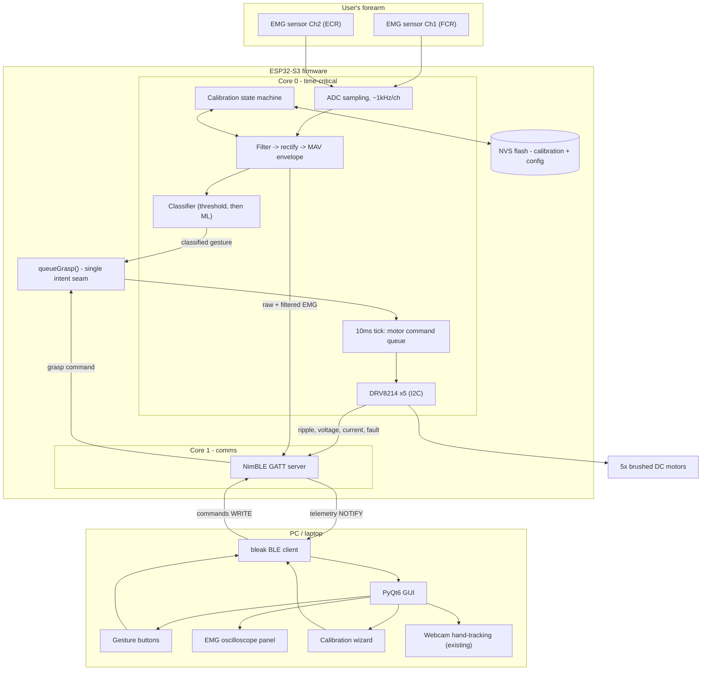

# EMG Gesture Control & Smart Interface — Development Plan

**Project:** EPSRC Prosthetic Hand Development (ENG:04)
**Scope:** EMG acquisition → calibration → gesture classification, BLE link, PyQt6 control/telemetry GUI
**Author context:** Newcastle University, MEng project, supervised by Dr. Matthew Dyson
**Date:** 2026-07-20
**Status:** Pre-development — planning document

---

## 0. What actually exists today

Before designing anything new, it's worth being precise about the current state, because the three pieces of the project that exist right now don't yet talk to each other:

| Component | File(s) | What it actually does | What it doesn't do |
|---|---|---|---|
| **Real motor firmware** | `src/main.cpp`, `lib/drv8214_multiplatform/` | Drives 5× real DRV8214-controlled motors over I2C, current-regulated, with a 10ms-tick command queue (`FIFObuf<motorCommand>`) and 8 named grasps via `queueGrasp()`. Takes commands over **Serial only** (typed integers). | No BLE, no WiFi, no telemetry out, no EMG. |
| **BLE/telemetry firmware** | (not in this repo — referenced as `exp08_telemetry_gesture` in GUI comments/docs) | NimBLE GATT server, advertises `ProHand-Test`, pushes a 77-byte mock motor-telemetry frame at 5Hz, accepts grasp/LED commands. | **Simulated motors only** — comments in the GUI confirm "no real motor hardware attached." Doesn't drive the real DRV8214s. |
| **PC GUI** | `telemetry_gui.py` | PyQt6 + `bleak` + `qasync` app: motor telemetry table, fault panel, 8 grasp buttons, webcam-based hand-tracking demo, digital-twin hand render. Talks to the BLE firmware above. | No EMG anywhere in it. |

**The single biggest pre-requisite this plan surfaces that wasn't in the original ask: the real motor firmware and the BLE firmware need to be merged before EMG control means anything end-to-end.** Right now, sending a grasp command over BLE moves a *simulated* hand, not the real one. That merge is Phase 0 below, and it's on the critical path — EMG classification has nothing to actuate until it exists.

This document also draws on the project's existing literature base (Nayyar's closed-loop-feedback thesis, Wu/Dyson/Nazarpour's Arduino myoelectric system paper, Dyson's 2018 abstract-decoder paper, Fougner et al.'s control-terminology review) and the existing `context.md` / PRD, which originally scoped the GUI as a browser-based Web Bluetooth app. You're now building it as Python/PyQt instead — noted below as a deliberate, reasonable substitution (Web Bluetooth's inconsistent browser support, especially on Windows/Safari, is a common reason to move to a native client; `bleak` also gives you far better signal-processing/plotting tooling via numpy than a browser can).

---

## 1. Architectural principles

These are the abstractions worth committing to before writing code, because they determine how painful every later phase is. The target-state architecture all of this is building toward:



### 1.1 One intent-arbitration seam: `queueGrasp()`

The real firmware already has the right shape for this. `queueGrasp(graspName)` is the *only* place that knows how to sequence motors for a named grasp — today it's called from a demo loop and from Serial input. The BLE sandbox firmware calls the equivalent thing from a GATT write. **EMG classification should be a third caller of the exact same function, nothing more.**

Concretely: the EMG classifier's job is to decide "the user wants `POWER`" and call `queueGrasp(POWER)` — it should never touch motor drivers, timing, or the command queue directly. This keeps grasp *execution* (sequencing, timing, safety) as a single source of truth regardless of whether the trigger was a GUI button, webcam hand-tracking, or an EMG contraction. Don't let three intent sources evolve three different paths to the motors.

### 1.2 Firmware owns safety — always

The existing PRD non-functional requirement ("if the GUI loses connection, the ESP32 must independently fall back to a safe state") is the right instinct and needs to extend to EMG: a noisy or low-confidence classification must never actuate a grasp change. That gating (minimum confidence, minimum hold-time, electrode-quality check) has to live in firmware, not in the PC GUI — the GUI can be closed, crash, or lag; the hand can't inherit that risk. Treat the PC as a *thin client* for EMG the same way it already is for grasp buttons: `queueGrasp()`-callers decide intent, firmware decides whether it's safe to act on it.

### 1.3 A modular DSP pipeline, matching validated prior art

Wu, Dyson & Nazarpour's Arduino myoelectric system (the direct predecessor to this project) validated a 5-stage decomposition: **signal recording → filtering → feature extraction → controller → motor driver**, built and tested as independent modules. There's no reason to deviate from a decomposition that's already been peer-reviewed and demoed on comparable hardware. Section 4 below maps this directly onto files/modules.

### 1.4 Config-as-data, not scattered magic numbers

While reading `main.cpp` for this plan, several hardware constants were found stated two different ways in the same file or across files (details in §2.2). That's not a criticism of the code — it's exactly what happens when tunable numbers live as inline literals instead of one canonical source. Recommendation: a single config module (even a plain header with named constants, or a small JSON both firmware and Python import/generate from) for everything currently duplicated across `main.cpp` comments, `context.md` prose, and `telemetry_gui.py` comments — ripple counts, `KMC`/`KMC_SCALE`, reduction ratio, EMG thresholds once they exist. This is a small effort now and a real bug-prevention measure once EMG calibration adds a second category of tunable, per-user constants that must not drift out of sync between firmware and GUI.

### 1.5 Keep the incremental EXP-0X bring-up discipline

The project already has a good habit: `ESP32S3_DevKitC1_Experiments.md` defines numbered, self-contained bring-up experiments (EXP-01 GPIO, EXP-02 BLE) before integration, and the GUI is versioned against "EXP-08." EMG work should continue this pattern rather than jumping straight to an integrated build — see the EXP numbering proposed in Phase 1.

### 1.6 Dual-core allocation, revisited against what the code actually does

`context.md`'s roadmap proposes Core 0 = motor control + EMG sampling/filtering, Core 1 = BLE. That's still the right split, but one thing worth flagging now: `DRV8214.cpp`'s I2C calls (`getMotorVoltage()`, `getRippleCount()`, etc.) are **blocking, synchronous I2C transactions** — reading full telemetry from all 5 drivers is ~30 blocking reads per cycle. If EMG sampling needs a tight, jitter-free timer on the same core as that I2C polling, the I2C reads need to happen in a way that can't stall the EMG sample timer (a FreeRTOS task with a bounded time budget, not inline in the same tight loop as EMG acquisition). Worth an explicit timing budget once both are running on Core 0 — flagged as a Phase 0/1 risk, not solved here.

---

## 2. Phase 0 — Unify the firmware (prerequisite, not optional)

**Objective: one firmware image that drives the real hand over a real BLE connection, with real telemetry.** Nothing EMG-related is testable end-to-end until this exists.

### 2.1 Objectives

| # | Objective | Notes |
|---|---|---|
| O0.1 | Port `main.cpp`'s real motor control (DRV8214 driver instances, `motorQueue`, `queueGrasp`, `execMotorCommmand`, 10ms tick ISR) into the BLE-enabled firmware codebase | The BLE skeleton currently generates mock telemetry — replace its fake motor state with calls into the real driver. |
| O0.2 | Replace Serial integer input with `CHAR_MOTOR_CMD_UUID` text commands as the primary input path | Keep Serial as a debug fallback (useful for bench testing without BLE). |
| O0.3 | Replace the mock 77-byte telemetry generator with real values from `DRV8214::getRippleCount()`, `getMotorVoltage()`, `getMotorCurrent()`, `getDutyCycle()`, `getFaultStatus()` | GUI needs no changes for this — it already expects this exact frame shape. |
| O0.4 | Resolve the ripple-count width mismatch: the driver's `getRippleCount()` returns a **16-bit** register value, but the telemetry frame allocates a **32-bit** field (`uint32 ripple_count` in `FRAME_FORMAT`) | Decide: accumulate 16-bit hardware rollovers into a software `uint32_t` counter (needed if ripple counts should persist across a full grasp sequence without silently wrapping — a full ~30,000-ripple power-grip closure is close enough to the 65,535 register ceiling to be worth guarding explicitly), or narrow the frame field. Recommend the former. |
| O0.5 | Migrate FreeRTOS task split (Core 0 motor+EMG / Core 1 BLE) | Today's firmware is a single cooperative `loop()` + one ISR — fine for motors alone, not sufficient once BLE and EMG sampling both need airtime. |
| O0.6 | Retire the dead `loop_()` code block (`main.cpp` lines ~409–778, never called) | It's ~370 lines of superseded, `delay()`-heavy motor logic sitting in the same file as the live code. Archive it elsewhere (git history is enough) rather than leaving it as a trap for the next person editing this file. |
| O0.7 | Confirm Arduino-ESP32 core version compatibility between `main.cpp`'s timer API (`timerBegin`/`timerAttachInterrupt`, older-style signature) and whatever core version the NimBLE sandbox firmware was built against | Classic integration risk when merging two codebases developed at different times against a moving toolchain. |

### 2.2 Verify before relying on any of it (bugs/inconsistencies found in this review)

Worth a dedicated pass — not blocking, but each of these will bite silently if carried into EMG-triggered control:

| Finding | Where | Why it matters |
|---|---|---|
| `case POINTER` in `queueGrasp()` has no `break` before `case ROCK` | `main.cpp` ~line 282 | Triggering `POINTER` currently also runs the entire `ROCK` sequence immediately after. `PACK`'s fallthrough into `OPEN` looks plausibly intentional (thumb-tuck-then-open-flat reads as a real "pack" pose); `POINTER`→`ROCK` doesn't have an equally obvious rationale — worth confirming on hardware whether this is deliberate. |
| GUI comment attributes inverted FORWARD/REVERSE wiring to the **thumb** (`M1`/motor index 0); actual `execMotorCommmand()` inverts **motor 5** (`M5`, pinky) | `telemetry_gui.py` HandView comments vs. `main.cpp` `execMotorCommmand()` | The GUI's own comments admit this identity was inferred from grasp-sequence evidence, not read directly from firmware. Now that the real firmware is available, reconcile this before it matters for anything EMG-triggered — a wrong assumption here would make a correctly-classified gesture visibly move the wrong finger. |
| `RED_RATIO` is `64` in code; inline comment says "best guess is 1:16 so 16" | `main.cpp` line 11 | Comment and value disagree within the same line. |
| `MAX_RPM` is `800`; inline comment says "set at 400 to be safe" (a `400` version exists commented out above it) | `main.cpp` lines 12–13 | Same pattern — verify which value is actually current/intended. |
| `NUM_RIPPLES` is `7` in firmware; `context.md`/Nayyar's thesis state "14 per motor rotation" | `main.cpp` line 10 vs. project docs | Could be a legitimately refined/re-measured value (unlike the two above, this one isn't self-contradicting in-file) — but worth confirming which figure is current before it propagates into a position/percentage calculation. |
| Fault-bit decode is consistent between `DRV8214.cpp::printFaultStatus()` and the GUI's `FAULT_BITS` table | Both files | Not a problem — flagged here as a positive: the two independently-maintained codebases agree on hardware register semantics. It's specifically the *application-level* protocol (motor identity, grasp fallthrough) that has drifted, not the low-level hardware knowledge. Worth knowing which parts of the system have been staying in sync and which haven't. |

None of this blocks starting Phase 0 — it's the verification checklist to run *during* it, on the bench, before any of these constants matter for a human-controlled grasp.

---

## 3. Phase 1 — EMG signal acquisition

**Objective: get a clean, sampled, two-channel EMG signal into firmware, with nothing downstream depending on it yet.** Given hardware bring-up status is unconfirmed, this phase starts with verification, not an assumption that sensors are ready to go.

### 3.1 Objectives

| # | Objective |
|---|---|
| O1.1 | **EXP-09 (proposed next number after EXP-08): raw ADC bring-up.** Single Gravity EMG channel into one ESP32-S3 ADC1 pin (prefer ADC1 over ADC2 — historically contested alongside radio activity on ESP32 parts; confirm empirically for the S3 during this experiment rather than assuming). Stream raw samples over Serial, sanity-check against an oscilloscope or Arduino Serial Plotter: expected a biased, noisy AC signal around the sensor's mid-supply offset, amplitude changing visibly with muscle contraction. |
| O1.2 | Confirm sample rate. Surface EMG's useful bandwidth is roughly 20–450 Hz; sample at ~1 kHz per channel to sit comfortably above Nyquist. Implement via a second hardware timer (mirroring the existing `tick10ms` ISR pattern: ISR only flags "sample now," the actual `analogRead()` happens in a task/loop, never inside the ISR itself). |
| O1.3 | Extend to 2 channels (PRD's stated minimum — e.g. FCR/ECR per the existing literature). Confirm no cross-talk or timing skew between channels at the chosen sample rate. |
| O1.4 | **Electrical safety check-in before this touches skin.** This is now a circuit with electrodes on a human arm connected to a microcontroller. Wu et al.'s predecessor system explicitly went through Newcastle University ethics approval before human testing — treat that as precedent, not optional process. Confirm sensor board isolation/specs and get the appropriate sign-off before any live-arm session, even an informal one. |
| O1.5 | Signal conditioning chain, per Wu et al.'s validated approach: DC-bias removal → notch filter (regional mains frequency) → rectification → Mean Absolute Value (MAV) envelope over a sliding window. Implement as an isolated, independently testable module (§1.3) — feed it synthetic signals first, real ADC samples second. |

### 3.2 Design decision: where does filtering run?

Given the "PC first, then port" answer for the classifier, apply the same logic here where practical: the *raw* ADC-to-BLE path can exist early (send raw samples to the PC, prototype filtering in Python/numpy where iteration is fast), but the **production filter chain belongs in firmware** long-term, same reasoning as §1.2 — a classifier that only works when tethered to a laptop running a specific Python filter isn't a finished system. Treat the Python-side filtering as a prototyping tool, not the final architecture.

---

## 4. Phase 2 — Calibration workflow

**Objective: a repeatable, GUI-driven calibration flow that runs once EMG sensors are connected, producing per-channel thresholds the classifier can use — matching the explicit ask.**

### 4.1 Calibration state machine (firmware)

```
IDLE → REST_CAPTURE → MVC_CAPTURE (per channel) → [pattern-recognition only: PER_GESTURE_CAPTURE] → COMPUTE_AND_CONFIRM → SAVED
```

- **REST_CAPTURE**: user relaxed, capture N seconds per channel → establishes noise floor.
- **MVC_CAPTURE**: user performs a maximum voluntary contraction per channel → establishes saturation ceiling.
- **COMPUTE_AND_CONFIRM**: derive working thresholds (e.g. noise floor + margin as the "on" threshold, MVC as normalization ceiling for proportional control), show the result in the GUI before committing.
- **SAVED**: persist to on-device NVS flash (so calibration survives reboot and the hand is usable without the PC present) *and* export to a PC-side file for backup/versioning (§1.4's config-as-data principle applies here directly — calibration is exactly the kind of per-user tunable data that needs one canonical, versioned home).

### 4.2 Objectives

| # | Objective |
|---|---|
| O2.1 | Define and implement the calibration state machine on firmware, driven by BLE commands. |
| O2.2 | New characteristics: extend the existing `CHAR_MOTOR_CMD_UUID` ASCII-command vocabulary for simple triggers (`calibrate_start`, `calibrate_rest`, `calibrate_mvc:0`, `calibrate_mvc:1`, `calibrate_save`, `calibrate_cancel`) — reuses an existing, proven pattern rather than inventing new plumbing. Add one new small binary characteristic (proposed `CHAR_EMG_CONFIG_UUID`) for exchanging the actual threshold values as packed floats in both directions (push computed calibration to firmware; read current calibration back for the GUI to display). Confirm proposed UUIDs don't collide with `CHAR_MOTOR_DIRECT_UUID`, which is documented in the GUI's help text but not yet assigned a value in the code reviewed here. |
| O2.3 | NVS persistence on-device; JSON export/import on the PC side for backup and offline review. |
| O2.4 | GUI calibration wizard (see §6) — step-by-step dialog, live scope during capture, clear rest/contract prompts with a countdown, save/replay/redo. |
| O2.5 | Recalibration path: sensors shift position between sessions (donning/doffing) — the workflow needs to be fast enough to redo per-session, not a one-time setup buried in a settings menu. |

---

## 5. Phase 3 — Classification / intent decoding

Per your direction: **phased, threshold-based first, prototyped on the PC, ported to firmware once proven; pattern-recognition/ML as a later stretch.**

### 5.1 Phase 3a — Threshold-based direct/proportional control (MVP)

The validated baseline from Wu et al.: MAV amplitude vs. calibrated per-channel thresholds drives a direct or co-contraction-based controller (their demo used FCR/ECR contraction and co-contraction to step through grip states — the same state-machine-over-EMG-thresholds approach maps directly onto the existing `graspName` enum and `queueGrasp()`).

| # | Objective |
|---|---|
| O3.1 | Prototype the threshold classifier in Python against streamed raw+filtered EMG telemetry (reuse the oscilloscope panel from Phase 1 for visual validation while tuning). Fast iteration, easy plotting — exactly where PC-side prototyping earns its keep. |
| O3.2 | Validate against the co-contraction control-state-machine pattern demonstrated in Wu et al. (their Fig. 2: FCR contraction → state 1 → power grip; FCR+ECR co-contraction → tripod/lateral; ECR alone → reset/open) as a starting point, adapted to this project's 8-grasp vocabulary. |
| O3.3 | Once validated, port the identical threshold logic into firmware (Core 1 or a dedicated task), calling `queueGrasp()` directly — same seam as button/CV input (§1.1). This removes the PC dependency for basic EMG control. |
| O3.4 | Safety gating in firmware: minimum confidence/margin above threshold, minimum hold-time before a classification is allowed to change the current grasp (prevents single-twitch false triggers), and an explicit EMG-enable/disable flag that a GUI "kill switch" toggle controls but that firmware itself enforces (§1.2 — don't let this be GUI-only). |

### 5.2 Phase 3b — Pattern recognition / abstract decoding (stretch)

Reference: Dyson (2018), *"Myoelectric control with abstract decoders"* — the project's own prior art for treating EMG channels as a 2D control space rather than mapping each muscle biomimetically to one grasp. `context.md`'s roadmap already names this as the long-term direction ("Abstract Decoding: treating muscles like a 2D joystick").

| # | Objective |
|---|---|
| O3.5 | Define the feature set beyond MAV if moving to pattern recognition (e.g. waveform length, zero-crossings, autoregressive coefficients — standard EMG pattern-recognition feature families). |
| O3.6 | Per-gesture training-data capture, reusing the calibration wizard's UX pattern from Phase 2 rather than building a separate flow. |
| O3.7 | Classifier choice suited to microcontroller deployment — LDA is the traditional low-compute choice for this exact application and a reasonable default; only reach for a small neural net (TensorFlow Lite Micro) if LDA's accuracy proves insufficient in testing. Don't start here — start with LDA. |
| O3.8 | **Important caution from the literature, worth building into the test plan now rather than discovering it later:** the paper by Ortiz-Catalan et al. cited in Wu et al.'s own bibliography is literally titled *"Off-line accuracy: a potentially misleading metric in myoelectric pattern recognition for prosthetic control."* A classifier that scores well on a held-out offline dataset can still be unusable in real-time closed-loop use (users adapt their muscle activity to the controller, which a static offline test can't capture). Whatever the eventual accuracy metric, pair it with real-time, closed-loop user trials before calling a classifier "done" — not just a confusion matrix. |

---

## 6. Phase 4 — PC GUI extensions

Concrete additions to `telemetry_gui.py`, following its existing structure rather than a rewrite:

| # | Objective | Where it fits in the existing file |
|---|---|---|
| O4.1 | New "EMG Signals" `QGroupBox` panel: scrolling raw + MAV-filtered oscilloscope, ≥2 channels, per the PRD's original NFR (process/render within 50ms). | Sits alongside `motor_data_box`/`fault_box` in `left_column`, or a new column if space is tight — the window's box-based layout already generalizes to this. |
| O4.2 | Decide the charting approach: hand-rolled `QPainter` (matches `HandView`'s existing style, zero new dependencies) vs. `pyqtgraph` (purpose-built for real-time scrolling data, much less code, one new dependency). Recommend `pyqtgraph` — an EMG scope updating at 20-30Hz with rolling history is exactly its use case, and hand-rolling that in raw `QPainter` is a lot of avoidable work compared to `HandView`'s much simpler static pose rendering. |
| O4.3 | Calibration wizard `QDialog`, modeled directly on the existing `HelpDialog` pattern (same non-modal `QDialog` approach already in the file) — step indicator, live scope embed, countdown prompts, save/redo. |
| O4.4 | Wire new characteristics into `on_connect_clicked`'s `start_notify` calls and the button handlers, following the exact existing pattern used for `CHAR_TELEMETRY_UUID`/`CHAR_MOTOR_CMD_UUID`. |
| O4.5 | EMG-enable/disable toggle (the kill switch from §5.1/O3.4) as a clearly-visible top-bar control, not buried in a submenu. |
| O4.6 | Address the schema-drift risk the codebase already flags on itself: `telemetry_gui.py`'s own comments note "there is no shared schema file between the two languages, so a mismatch here is a manual-sync risk to watch for." Two new binary frame formats (EMG telemetry, EMG config) are about to be added on top of the existing motor frame — worth a small shared schema description (even a hand-maintained YAML/JSON listing every characteristic's byte layout) with a lint or test that checks Python `struct` format strings against firmware struct sizes, rather than trusting comments to stay in sync a third time. |

---

## 7. Proposed repo layout

Mirrors conventions already in use (vendored libs under `lib/`, one concern per module in the GUI's `tools/` directory):

```
robolimb_esp32/                          (PlatformIO project — existing)
├── lib/
│   ├── drv8214_multiplatform/           (existing, vendored, MIT-licensed — leave as-is)
│   ├── FIFObuf/                         (existing)
│   ├── emg_acquisition/                 (new — ADC sampling + timer, EXP-09 output)
│   ├── emg_dsp/                         (new — notch/rectify/MAV, testable standalone)
│   ├── emg_calibration/                 (new — state machine + NVS persistence)
│   └── emg_classifier/                  (new — Phase 3a threshold logic first; 3b classifier later)
└── src/
    └── main.cpp                         (post-Phase-0: real motors + BLE + EMG, unified)

tools/exp0Xtools/                        (GUI-side — existing location per telemetry_gui.py's docstring)
├── telemetry_gui.py                     (existing — extended per §6)
├── gesture_to_serial.py                 (existing, CV hand-tracking)
├── emg_panel.py                         (new — oscilloscope widget)
├── calibration_wizard.py                (new — QDialog flow)
├── emg_classifier_proto.py              (new — Phase 3a Python prototype, throwaway once ported)
└── requirements.txt                     (existing — add pyqtgraph if adopted)
```

---

## 8. Testing & validation strategy

- **Bench-test without a human arm first.** Same philosophy the project already uses for motor sandboxing (the mock EXP-08 telemetry firmware) — feed the ADC input from a function generator or pre-recorded reference signal, or build a "fake EMG" firmware mode, so the calibration wizard, BLE plumbing, and classifier logic are fully validated before any electrode touches skin.
- **Ethics/safety sign-off before live-arm sessions** — see O1.4. Precedent already exists in this project's own literature base.
- **Real-time closed-loop validation for any classifier**, not just offline accuracy — see O3.8. This is the single most important testing-strategy point in this document; the literature is explicit that it's easy to get wrong.
- **Regression checklist** — the findings in §2.2 are the first things to verify once real hardware is on the bench, before layering EMG-triggered control on top of assumptions that haven't been confirmed.

---

## 9. Roadmap summary

| Phase | Focus | Depends on | Key deliverable |
|---|---|---|---|
| **0** | Unify real motor firmware + BLE/telemetry firmware | — | One firmware image, real hand controllable over BLE, real telemetry flowing to the existing GUI unchanged |
| **1** | EMG acquisition (EXP-09+) | Phase 0 firmware structure (for eventual integration); hardware bring-up status to be confirmed first | Clean, sampled, 2-channel EMG signal in firmware, conditioned (filtered/MAV) |
| **2** | Calibration workflow | Phase 1 | GUI-driven calibration wizard, persisted thresholds, on-device + PC-side storage |
| **3a** | Threshold classifier (PC prototype → firmware port) | Phase 2 | `queueGrasp()`-driven EMG control, tetherless, with safety gating |
| **3b** | Pattern recognition / abstract decoding (stretch) | Phase 3a proven in real-time use | Richer gesture set, LDA-first |
| **4** | GUI extensions | Can start in parallel with Phase 1 (scope panel) once raw EMG telemetry exists | EMG scope, calibration wizard, kill switch, shared schema doc |

Phases 0–2 are sequential and on the critical path. Phase 4's GUI work can start as soon as Phase 1 produces real EMG telemetry to visualize, rather than waiting for classification to be finished. Phase 3b is explicitly a stretch goal, not part of the initial working system.
